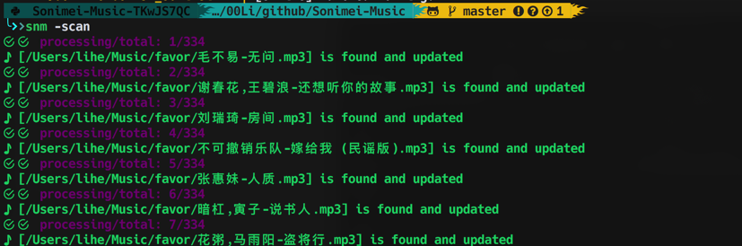

## Sonimei

music downloader of [sonimei.cn](http://music.sonimei.cn/)

> full supported in python3.7, macosx

### Todo

- [ ] parse netease playlist and download all
- [ ] cache qq album
- [ ] add nosetests

### Sites supported

- [x] qq
- [x] netease

### Capability

- [x] search of single song name/artist
- [x] multiple songs `split by #`
- [x] download and auto add ID3 tag:`cover`
- [x] pagination supported
- [x] scan directory and update ID3 tags
- [x] check local file before search
- [x] the search result: json/html raw file, auto cached, until you delete them
- [x] the search candidates cached in the app lifecycle
- [x] colorful ui :)

### Install

```bash
cd <PATH>/Sonimei-Music
python setup.py install
```

### sonime config/stored files/caches

#### config

config file: `~/.sonimei/sonimei.cfg`

```python
[log]
enabled = false
file_pth = /Users/lihe/.sonimei/sonimei.log
file_backups = 3
file_size = 5
level = 10
symbol = ☰☷☳☴☵☲☶☱

[pretty]
# install hacknerd font for full chars
symbols =  ,,,, ,,,,,,,,ﴖ,,,,,,,♪,

[snm]
save_dir = ~/Music/sonimei
```

#### songs

edit config:`sonimei.cfg`

#### caches

cached raw: `~/.crawler/music.sonimei.cn/` 

cached netease raw: `~/.crawler/music.163.com`

### usage

if installed `snmcli` can be called from terminal

#### no params: `snmcli`

if no params supplied, will show `-h` hints

#### show help: `snmcli -h/--help`


#### search single song/artist


##### keys supported in search lifecycle

`nN` load next page

`pP` load previous page

`bB` go back one layer

`1~10` the number, will download the song

`s` skip current song, if in scan mode

#### choose site: -s netease


#### scan

will scan songs saved dir, and try to fix ID3 tags and cover



