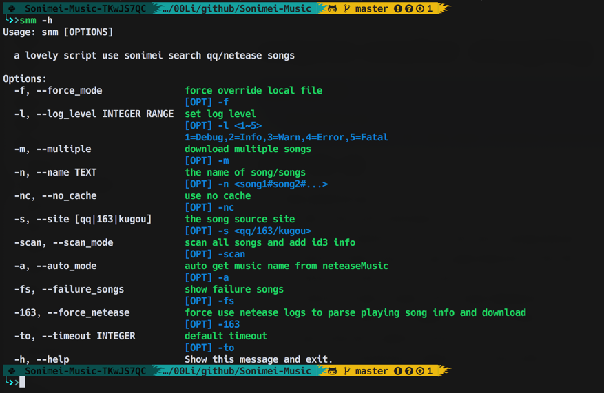
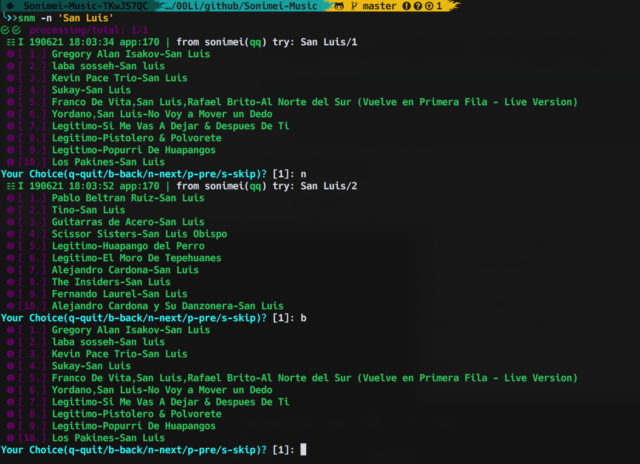

## Sonimei

music downloader of [sonimei.cn](http://music.sonimei.cn/)

> full supported in python3.7, macosx

### Todo

- [ ] ~~parse netease playlist and download all~~
- [ ] add nosetests
- [ ] maybe more other sites from sonimei

### Sites supported

- [x] qq
- [x] 163(netease)
- [x] kugou

### Capability

- [x] search of single song name/artist
- [x] multiple songs `split by #`
- [x] download and auto add ID3 tag:`cover`
- [x] pagination supported
- [x] scan directory and update ID3 tags
- [x] check local file before search
- [x] the search result: json/html raw file, auto cached, until you delete them
- [x] the search candidates cached in the app lifecycle
- [x] colorful ui :)

#### new features

- [x] auto cache downloaded album covers, until you manually delete them
- [x] if you are listening NeteaseMusic, with `snm -a` will auto get the song's name and try download it, no need to copy/search anymore
- [x] if the NeteaseMusic with High-Qulity `320Kbps`, will prompt to download it directly, but you can always skip it.
- [x] if some song download failed, will store it, and with `snm -fs` you can re-download it again.

### Install

```bash
cd <PATH>/Sonimei-Music
python setup.py install
# reinstall
pip/3 uninstall sonimei -y && python setup.py instal
```

### sonime config/stored files/caches

#### config

config file: `~/.sonimei/sonimei.cfg`

```python
[log]
enabled = false
file_pth = /Users/lihe/.sonimei/sonimei.log
file_backups = 3
file_size = 5
level = 10
symbol = ☰☷☳☴☵☲☶☱

[pretty]
# install hacknerd font for full chars
symbols =  ,,,, ,,,,,,,,ﴖ,,,,,,,♪,

[snm]
save_dir = ~/Music/sonimei
```

#### songs

edit config:`sonimei.cfg`

#### caches

cached raw: `~/.crawler/music.sonimei.cn/raw` 

cached covers: `~/.crawler/music.sonimei.cn/media`

cached netease raw: `~/.crawler/music.163.com`

### usage

if installed `snm` can be called from terminal

#### new feature

##### A. `snm -a` will get current playing neteasemusic song, and try download

##### B. `snm -fs` will found all download failed songs, and try re-download them.


#### no params: `snm`

if no params supplied, will show `-h` hints

#### show help: `snm -h/--help`



#### search single song/artist



##### keys supported in search lifecycle

`nN` load next page

`pP` load previous page

`bB` go back one layer

`1~10` the number, will download the song

`s` skip current song, if in scan mode

#### choose site: -s 163/kugou 

but now, both not available `I just use the sonimei site result`, I don't use 163/kugou, I prefer qq, so I just leave it here.


#### scan

will scan songs saved dir, and try to fix ID3 tags and cover


